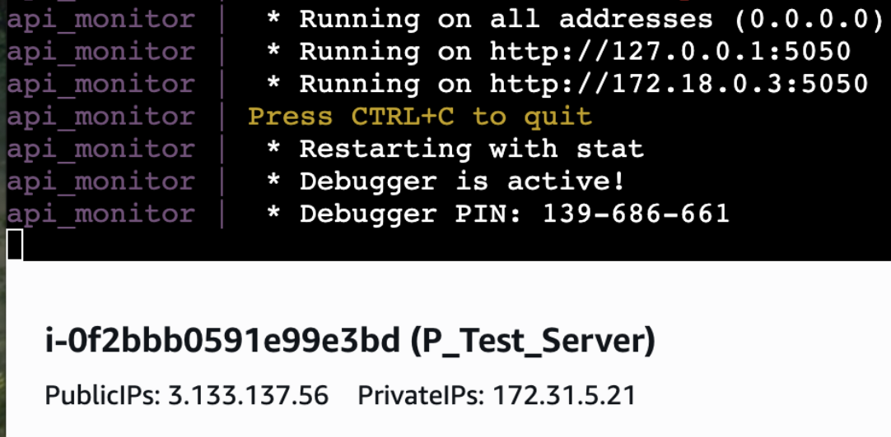
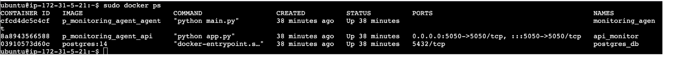
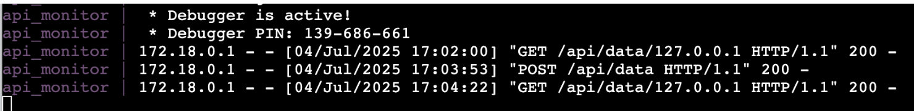
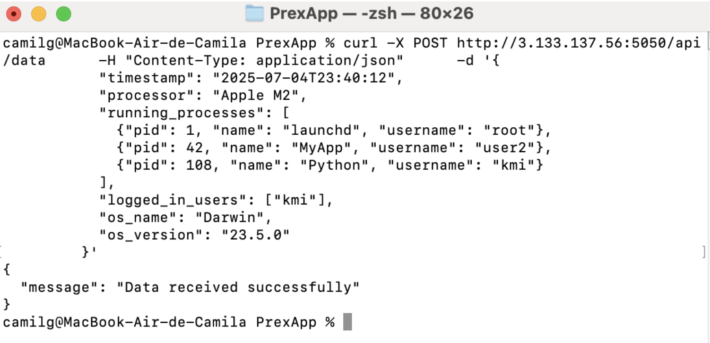
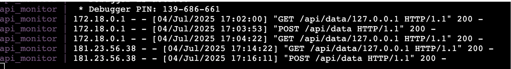

# Technical Challenge: Sistema de Relevamiento de Servidores

Este proyecto consiste en un sistema de monitoreo y relevamiento de servidores compuesto por dos componentes principales:

## Componentes

- **Agente de Monitoreo**: Se ejecuta en un servidor y envía métricas del sistema (Información del procesador, del SO, procesos y usuarios, etc.) diariamente.
- **API Receptora**: Recibe las métricas enviadas por los agentes, las almacena en un archivo CSV y también en una base de datos para su posterior análisis.

## Contenerización

Ambas aplicaciones están **dockerizadas** para facilitar su despliegue y ejecución en cualquier entorno compatible con Docker.

## Cómo correr la aplicación

1. Clonar el repositorio:
   
   * git clone https://github.com/CamiLG/P_Monitoring_Agent.git 
   * cd P_Monitoring_Agent
   * Ejecutar el script ./run.sh para entornos Linux
   * Ejecutar el script .\run.ps1 en Windows 

### Evidencia de ejecución en instancia EC2 

Para este desafío probé tanto el agente como la api de forma local y remota en el servidor EC2. 
 

Una vez levantadas las aplicaciones correctamente, registré el envío de información desde el mismo agente y desde mi pc de forma remota: 

El envío de métricas por parte del agente se podría realizar a través de un cron, pero por simplicidad elegí la librería schedule de Python que permite realizar la ejecución programada de un job. 

### Aspectos a mejorar
Como mejoras agregaría las capas de seguridad necesarias en la comunicación entre el agente y la api, ya que para este entregable la implementación la hice en http, sin autenticación y con un Security Group sin muchas restricciones, lo que lo hace vulnerable a accesos no autorizados, ataques Sniffing y MiTM, Defacement, entre otros.  

